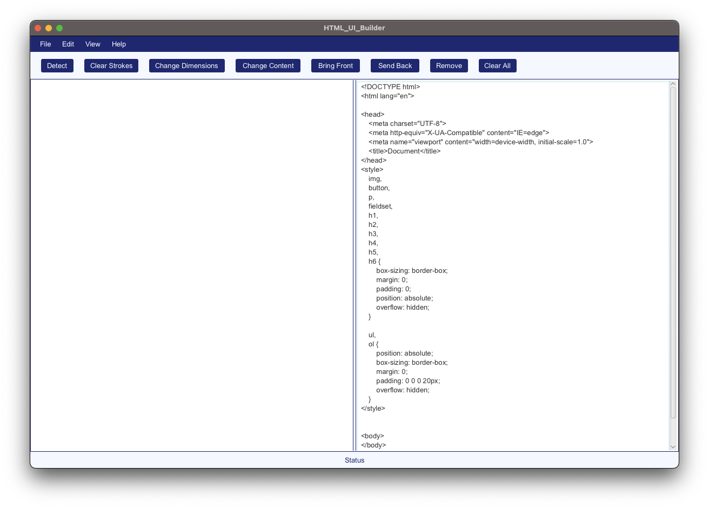
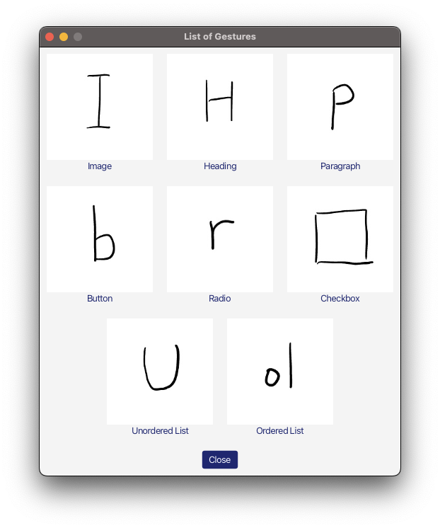
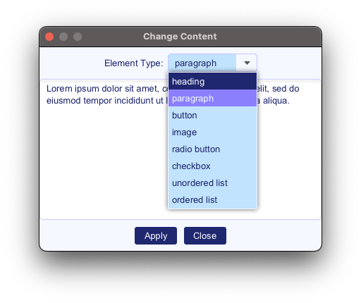

# HTML UI Builder (HUB)

Creating functional user interface (UI) layouts can be challenging for designers who are inexperienced in programming. Established tooling for this process has historically provided first-class support for adding UI components to interfaces via text-based markup, but not for doing so in the same visual domain the UI components occupy. The asymmetry between the domain designers conceptualizing interface layouts and that of the underlying representation designers as developers need to create them makes the process of creating UI layouts a major bottleneck in the prototyping stage of design thinking. We propose a UI building software that addresses this issue of asymmetry in the development of websites by allowing users to incrementally piece together functional website layouts in the space of the layouts themselves rather than through a Hyper-Text Markup Language (HTML) document. Critically, the HTML UI Builder (HUB) still outputs source code that can be portably deployed in live websites.

## Requirements
This code requires `JavaFX` to run successfully

## Features

#### Virtual Canvas
- Left side of the main screen
- Allows users to draw gestures using a mouse controller or a stylus (left click to draw, right click to register gesture)
- Detects gestures using `$Q recognizer`

#### HTML Source Code
- Right side of the main screen
- Converts gestures into HTML source code
- Updated in real-time 

#### HTML Rendering
- Left side of the main screen
- Lies beneath the Virtual Canvas
- Actual HTML rendering of the source code
- Allows simple manipulations such as resizing / relocating elements
- Right click element to do more complex manipulations
- All changes are made to the source code in real-time

[Link](hub_report.pdf) to the project report